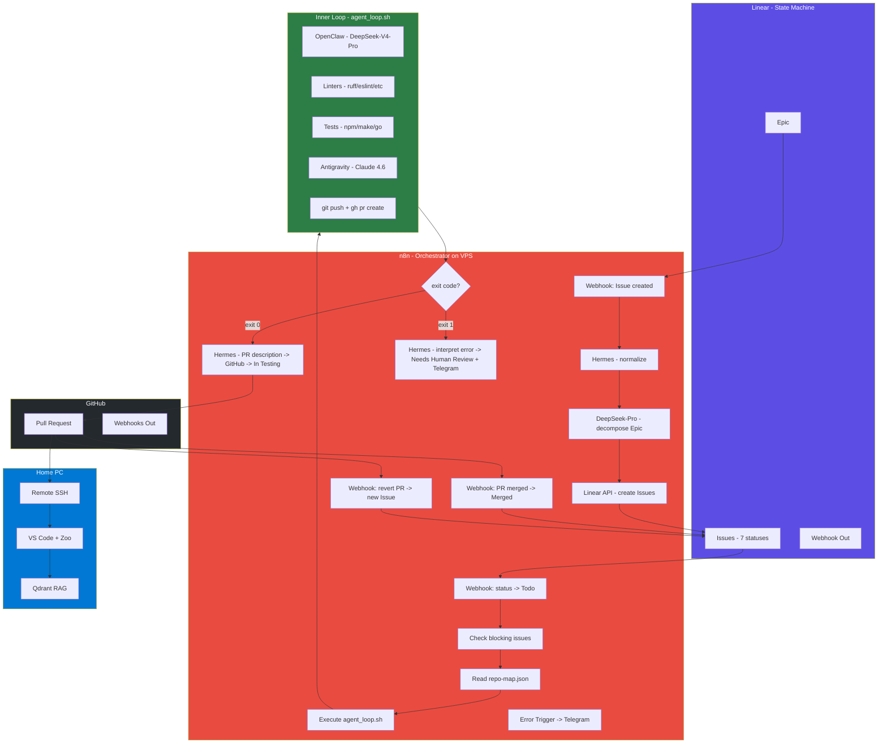
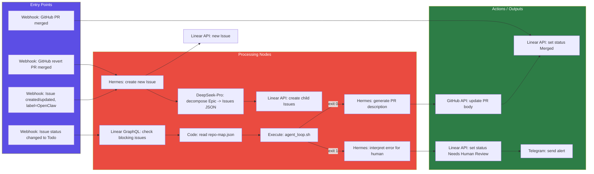

# Autonomous Multi-Agent System — Implementation Plan

**Status:** Draft Technical Specification
**Date:** 2026-07-10
**Target:** VPS (4 GB RAM Linux) + Home PC (Windows 11)

---

## Architecture Overview



### Linear State Machine (7 Statuses)

```
Backlog -> Todo -> In Progress -> In Testing -> In Review -> Done -> Merged
                       |                |              |
                       v                v              v
               Needs Human Review   In Progress   (terminal)
               (if agent_loop      (if human
                exhausted 4         rejected PR)
                retries)
```

### Agent-Model Mapping

| Agent           | Location | Model                           | Role                                                                        |
| --------------- | -------- | ------------------------------- | --------------------------------------------------------------------------- |
| OpenClaw        | VPS      | DeepSeek-V4-Pro                 | Code generation                                                             |
| OpenClaw        | VPS      | DeepSeek-V4-Flash               | Bash utilities, fast ops                                                    |
| Antigravity CLI | VPS      | Claude 4.6 (Google One credits) | **ONLY** critic/reviewer                                                    |
| n8n             | VPS      | DeepSeek-V4-Pro                 | Epic decomposition                                                          |
| Hermes          | VPS      | DeepSeek-V4-Flash               | n8n utility: normalize webhooks, generate PR descriptions, interpret errors |
| Zoo + Qdrant    | Home PC  | DeepSeek-V4-Pro/Flash           | Human review with RAG context                                               |

---

## Phase 0: VPS Preparation

### 0.1 Users and Groups

**Checklist:**

- [ ] 0.1.1 Verify existing users exist on VPS:

  ```
  cat /etc/passwd | grep -E "n8n_user|openclaw_user|antigravity_user|hermes_user"
  ```

  If any missing, create with:

  ```bash
  sudo useradd -m -s /bin/bash <username>
  ```

- [ ] 0.1.2 Create `ai-workers` group:

  ```bash
  sudo groupadd ai-workers
  ```

- [ ] 0.1.3 Add all users to `ai-workers`:

  ```bash
  sudo usermod -aG ai-workers n8n_user
  sudo usermod -aG ai-workers openclaw_user
  sudo usermod -aG ai-workers antigravity_user
  sudo usermod -aG ai-workers hermes_user
  ```

- [ ] 0.1.4 Verify group membership:
  ```bash
  groups n8n_user openclaw_user antigravity_user hermes_user
  ```

### 0.2 Project Directory Permissions (SGID)

**Checklist:**

- [ ] 0.2.1 For each project repository, apply SGID:

  ```bash
  sudo chown -R :ai-workers /path/to/each/project
  sudo chmod -R 2775 /path/to/each/project
  find /path/to/each/project -type d -exec chmod 2775 {} \;
  find /path/to/each/project -type f -exec chmod 0664 {} \;
  ```

  **Note:** Initial scope is ONE repository. Multi-repo support is added later via `repo-map.json`.

- [ ] 0.2.2 Set `umask 0002` in each agent's `~/.bashrc`:

  ```bash
  echo "umask 0002" | sudo tee -a /home/openclaw_user/.bashrc
  echo "umask 0002" | sudo tee -a /home/antigravity_user/.bashrc
  echo "umask 0002" | sudo tee -a /home/hermes_user/.bashrc
  ```

- [ ] 0.2.3 Ensure agents' home directories have correct `.gitconfig`:
  ```bash
  # For openclaw_user
  sudo -u openclaw_user git config --global user.name "OpenClaw Agent"
  sudo -u openclaw_user git config --global user.email "openclaw@ai-bot.local"
  ```

### 0.3 Linter Installation (`/usr/local/bin/`)

**Checklist:**

- [ ] 0.3.1 **ruff** (Python):

  ```bash
  curl -LsSf https://astral.sh/ruff/install.sh | sh
  sudo mv ~/.cargo/bin/ruff /usr/local/bin/
  sudo chmod 755 /usr/local/bin/ruff
  ruff --version
  ```

- [ ] 0.3.2 **golangci-lint** (Go):

  ```bash
  curl -sSfL https://raw.githubusercontent.com/golangci/golangci-lint/master/install.sh | sudo sh -s -- -b /usr/local/bin v1.59.1
  sudo chmod 755 /usr/local/bin/golangci-lint
  golangci-lint --version
  ```

- [ ] 0.3.3 **eslint** (JavaScript/TypeScript):

  ```bash
  sudo npm install -g eslint
  sudo chmod 755 $(which eslint)
  eslint --version
  ```

- [ ] 0.3.4 **stylelint** (CSS):

  ```bash
  sudo npm install -g stylelint
  sudo chmod 755 $(which stylelint)
  stylelint --version
  ```

- [ ] 0.3.5 **markdownlint-cli** (Markdown):

  ```bash
  sudo npm install -g markdownlint-cli
  sudo chmod 755 $(which markdownlint)
  markdownlint --version
  ```

- [ ] 0.3.6 Verify all linters are in PATH for each agent user:
  ```bash
  sudo -u openclaw_user which ruff golangci-lint eslint stylelint markdownlint
  sudo -u antigravity_user which ruff golangci-lint eslint stylelint markdownlint
  ```

### 0.4 Secrets Structure (`/opt/secrets/`)

**Checklist:**

- [ ] 0.4.1 Create directory:

  ```bash
  sudo mkdir -p /opt/secrets
  sudo chown root:root /opt/secrets
  sudo chmod 750 /opt/secrets
  ```

- [ ] 0.4.2 Create `/opt/secrets/shared.env` (ownership `640`, group `ai-workers`):

  ```bash
  sudo tee /opt/secrets/shared.env > /dev/null << 'EOF'
  # Shared secrets - sourced by all agent env files
  DEEPSEEK_API_KEY=sk_your_deepseek_key_here
  GITHUB_TOKEN=ghp_your_github_pat_here
  EOF
  sudo chown root:ai-workers /opt/secrets/shared.env
  sudo chmod 640 /opt/secrets/shared.env
  ```

- [ ] 0.4.3 Create `/opt/secrets/n8n.env` (ownership `600`, user `n8n_user`):

  ```bash
  sudo tee /opt/secrets/n8n.env > /dev/null << 'EOF'
  # n8n-specific secrets
  source /opt/secrets/shared.env
  LINEAR_API_KEY=lin_api_your_linear_key_here
  EOF
  sudo chown n8n_user:n8n_user /opt/secrets/n8n.env
  sudo chmod 600 /opt/secrets/n8n.env
  ```

- [ ] 0.4.4 Create `/opt/secrets/openclaw.env` (ownership `600`, user `openclaw_user`):

  ```bash
  sudo tee /opt/secrets/openclaw.env > /dev/null << 'EOF'
  # OpenClaw-specific secrets
  source /opt/secrets/shared.env
  EOF
  sudo chown openclaw_user:openclaw_user /opt/secrets/openclaw.env
  sudo chmod 600 /opt/secrets/openclaw.env
  ```

- [ ] 0.4.5 Create `/opt/secrets/antigravity.env` (ownership `600`, user `antigravity_user`):

  ```bash
  sudo tee /opt/secrets/antigravity.env > /dev/null << 'EOF'
  # Antigravity-specific secrets
  source /opt/secrets/shared.env
  ANTI_GRAVITY_TOKEN=your_antigravity_token_here
  EOF
  sudo chown antigravity_user:antigravity_user /opt/secrets/antigravity.env
  sudo chmod 600 /opt/secrets/antigravity.env
  ```

- [ ] 0.4.6 Create `/opt/secrets/hermes.env` (ownership `600`, user `hermes_user`):

  ```bash
  sudo tee /opt/secrets/hermes.env > /dev/null << 'EOF'
  # Hermes-specific secrets
  source /opt/secrets/shared.env
  EOF
  sudo chown hermes_user:hermes_user /opt/secrets/hermes.env
  sudo chmod 600 /opt/secrets/hermes.env
  ```

- [ ] 0.4.7 Configure each agent to source its env file on login. Add to each user's `~/.bashrc`:

  ```bash
  # For each user, add:
  source /opt/secrets/<username>.env
  ```

  For n8n systemd service, use `EnvironmentFile` directive (see section 0.6).

### 0.5 Configuration Structure (`/opt/config/`)

**Checklist:**

- [ ] 0.5.1 Create directory:

  ```bash
  sudo mkdir -p /opt/config
  sudo chown :ai-workers /opt/config
  sudo chmod 2775 /opt/config
  ```

- [ ] 0.5.2 Create `/opt/config/repo-map.json`:

  ```json
  [
    {
      "linear_project_id": "<UUID-from-Linear>",
      "name": "<human-readable-project-name>",
      "repo_path": "/path/to/project/repo",
      "default_branch": "main"
    }
  ]
  ```

  Set permissions:

  ```bash
  sudo chown :ai-workers /opt/config/repo-map.json
  sudo chmod 664 /opt/config/repo-map.json
  ```

  **Note:** Start with ONE repository. Add more entries as the system scales to multi-repo.

### 0.6 n8n Installation (npm, not Docker)

**Checklist:**

- [ ] 0.6.1 Install n8n as `n8n_user`:

  ```bash
  sudo -u n8n_user -i
  npm install -g n8n
  n8n --version
  exit
  ```

- [ ] 0.6.2 Create systemd service file `/etc/systemd/system/n8n.service`:

  ```ini
  [Unit]
  Description=n8n Workflow Automation
  After=network.target

  [Service]
  Type=simple
  User=n8n_user
  Group=n8n_user
  EnvironmentFile=/opt/secrets/n8n.env
  Environment=N8N_PORT=5678
  Environment=N8N_HOST=0.0.0.0
  Environment=N8N_PROTOCOL=http
  Environment=NODE_ENV=production
  Environment=WEBHOOK_URL=https://your-vps-domain-or-ip:5678/
  ExecStart=/usr/bin/n8n start
  Restart=on-failure
  RestartSec=10

  [Install]
  WantedBy=multi-user.target
  ```

- [ ] 0.6.3 Enable and start:

  ```bash
  sudo systemctl daemon-reload
  sudo systemctl enable n8n
  sudo systemctl start n8n
  sudo systemctl status n8n
  ```

- [ ] 0.6.4 Verify n8n is running:
  ```bash
  curl http://localhost:5678/healthz
  ```

### 0.7 Scripts Directory (`/opt/scripts/`)

**Checklist:**

- [ ] 0.7.1 Create directory:

  ```bash
  sudo mkdir -p /opt/scripts
  sudo chown :ai-workers /opt/scripts
  sudo chmod 2775 /opt/scripts
  ```

- [ ] 0.7.2 Ensure `agent_loop.sh` will be placed here (Phase 1).

---

## Phase 1: agent_loop.sh Specification

### 1.1 Script Signature

```
/opt/scripts/agent_loop.sh <repo_path> <ticket_id> "<description>"
```

| Argument      | Description                                             | Example                              |
| ------------- | ------------------------------------------------------- | ------------------------------------ |
| `repo_path`   | Absolute path to the repository on VPS                  | `/home/projects/my-app`              |
| `ticket_id`   | Linear issue identifier                                 | `LIN-42`                             |
| `description` | Task description (title + body, JSON-encoded if needed) | `"Add user authentication endpoint"` |

**Exit codes:**

- `0` — Success: PR created, code approved
- `1` — Failure: retries exhausted, needs human intervention
- `2` — Failure: no changes produced by coder (terminal)

### 1.2 Environment

Before execution, the script MUST source its secrets:

```bash
source /opt/secrets/openclaw.env
export PATH="/usr/local/bin:$PATH"
```

**Assumed available:**

- `openclaw` CLI (configured with DeepSeek-V4-Pro and DeepSeek-V4-Flash)
- `antigravity` CLI (configured with Claude 4.6 via Google One credits)
- `gh` (GitHub CLI, authenticated via `GITHUB_TOKEN`)
- `git`
- `jq` (JSON parser)
- All linters from Phase 0.3
- Project test runners as configured per repo

### 1.3 Algorithm (Pseudocode)

```
agent_loop.sh(repo_path, ticket_id, description):

  1. VALIDATE: all 3 arguments non-empty. Exit 1 if missing.

  2. ENTER: cd $repo_path

  3. BRANCH:
     - git checkout default_branch
     - git pull origin default_branch
     - BRANCH_NAME = "feature/$ticket_id"
     - git checkout -b $BRANCH_NAME || git checkout $BRANCH_NAME

  4. LOG: start logging to /tmp/agent_loop_${ticket_id}_$(date +%Y%m%d_%H%M%S).log
     - Log EVERY step with timestamp
     - Log OpenClaw and Antigravity raw outputs (truncated to 5000 chars)

  5. MAIN LOOP (max 4 retries, ATTEMPT=0..3):

     5a. CODER:
         - Compose task: if ATTEMPT > 0, prepend "Fix the following issues:\n<feedback>"
         - Run: openclaw run "$TASK_DESC" --model deepseek-v4-pro 2>&1 | tee -a $LOG
         - Note: For quick bash operations within OpenClaw, DeepSeek-V4-Flash is used internally

     5b. CHECK CHANGES:
         - MODIFIED_FILES = $(git diff --name-only --diff-filter=AM)
         - If empty: log "[ERROR] No changes produced." Exit 2.

     5c. LINTERS (dynamic by extension):
         - LINT_FAILED = false
         - For each FILE in MODIFIED_FILES:
             EXT = "${FILE##*.}"
             case $EXT in:
               py: ruff check "$FILE" || LINT_FAILED=true
               go: golangci-lint run "$FILE" || LINT_FAILED=true
               js|ts|jsx|tsx: eslint "$FILE" || LINT_FAILED=true
               css|scss|less: stylelint "$FILE" || LINT_FAILED=true
               md: markdownlint "$FILE" || LINT_FAILED=true
               *: skip (no linter configured)
         - If LINT_FAILED:
             LINT_OUTPUT = first 20 lines of lint errors
             TASK_DESC = "Fix linter errors:\n$LINT_OUTPUT"
             ATTEMPT++ ; continue  (back to step 5a)

     5d. TESTS (skip if no test config found):
         - Check for test configuration files:
             * package.json with "test" script → npm test
             * Makefile with "test" target → make test
             * go.mod present → go test ./...
         - If no config found: log "[INFO] No test configuration detected. Skipping tests."
         - If test command fails:
             TEST_OUTPUT = last 50 lines of test output
             TASK_DESC = "Fix failing tests:\n$TEST_OUTPUT"
             ATTEMPT++ ; continue  (back to step 5a)

     5e. CRITIC (Antigravity + Claude 4.6):
         - DIFF = $(git diff)
         - REVIEW_PROMPT = system prompt from /opt/config/reviewer_prompt.txt (see 1.4)
         - Run: antigravity run "Review this code diff:\n$DIFF\n\nOriginal task: $ORIGINAL_DESC" \
                  --model claude-4.6-sonnet \
                  --system-prompt "$(cat /opt/config/reviewer_prompt.txt)" \
                  2>&1 | tee -a $LOG
         - Parse JSON from output: STATUS, FEEDBACK
         - If STATUS == "approve":
             goto step 6 (SUCCESS)
         - Else (STATUS == "reject"):
             TASK_DESC = "Fix the following issues:\n$FEEDBACK"
             ATTEMPT++ ; continue  (back to step 5a)

  6. SUCCESS PATH (STATUS == "approve"):
     - git add .
     - git commit -m "feat($ticket_id): automated implementation"
     - git push origin $BRANCH_NAME
     - gh pr create \
         --title "[AUTO] $ticket_id: <first line of description>" \
         --body "$(generate_pr_body)"
     - Check for docker-compose.yml in changed files:
         If found: docker compose up -d (optional preview)
     - Log: "[SUCCESS] PR #<number> created."
     - Exit 0

  7. FAILURE PATH (ATTEMPT >= 4):
     - Log: "[ERROR] Max retries ($MAX_RETRIES) exhausted."
     - git reset --hard  (discard all changes)
     - git checkout $DEFAULT_BRANCH
     - git branch -D $BRANCH_NAME (clean up feature branch)
     - Exit 1
```

### 1.4 Critic System Prompt (`/opt/config/reviewer_prompt.txt`)

```
You are a Senior Staff Security and QA Engineer. Your task is to mercilessly review the provided code diff and ensure it meets the business requirements without introducing bugs.

Rules:
1. DO NOT rewrite the entire codebase. Point out specific lines with critical issues.
2. Focus strictly on:
   - Memory leaks, infinite loops, and unhandled exceptions
   - Security vulnerabilities (injection, insecure tokens, XSS)
   - Edge cases and race conditions
   - Architectural alignment with the existing codebase patterns
   - Business logic correctness relative to the task description
3. If basic error handling is missing, demand it.
4. Do NOT comment on code style or formatting (handled by linters).
5. Output strictly in JSON format, no other text:
   {"status": "approve" | "reject", "feedback": "specific, actionable feedback"}
6. Use "approve" ONLY if you found zero issues. Be conservative.
```

### 1.5 PR Body Generation

When the script succeeds, the PR body is composed by combining:

1. **Summary line:** "Automated implementation of {{ticket_id}}"
2. **Files changed:** `git diff --stat`
3. **Linter status:** "All linters passed"
4. **Test status:** "Tests passed" or "No test configuration detected"
5. **AI Critic verdict:** "Approved by Antigravity (Claude 4.6)"

This body can be enhanced by Hermes in the n8n workflow post-processing (Phase 2, Node 8-success).

### 1.6 Logging Specification

Log file location: `/tmp/agent_loop_${ticket_id}_$(date +%Y%m%d_%H%M%S).log`

Log format per entry:

```
[YYYY-MM-DD HH:MM:SS] [LEVEL] message
```

Levels: `INFO`, `WARN`, `ERROR`, `SUCCESS`

Key events logged:

- Script start with all arguments
- Each retry attempt start
- OpenClaw execution (output truncated to 5000 chars)
- Modified files list
- Linter results per file
- Test results (or skip reason)
- Antigravity verdict (full JSON)
- Git operations (commit hash, push result, PR URL)
- Script exit code

---

## Phase 2: n8n Workflow Specification

### 2.1 Workflow Overview



### 2.2 Detailed Node Specifications

#### Node 1: Webhook — Linear Issue Created/Updated (Epic Trigger)

| Parameter    | Value                                                                      |
| ------------ | -------------------------------------------------------------------------- |
| **Type**     | Webhook                                                                    |
| **Method**   | POST                                                                       |
| **Path**     | `/linear/issue-created`                                                    |
| **Response** | 200 OK immediately                                                         |
| **Trigger**  | Linear webhook: Issue created OR updated, when label `OpenClaw` is present |

**Expected Linear payload (normalized):**

```json
{
  "action": "create" | "update",
  "data": {
    "id": "uuid",
    "identifier": "LIN-1",
    "title": "Epic title",
    "description": "Epic description",
    "state": { "name": "Backlog" },
    "labels": [{ "name": "OpenClaw" }]
  }
}
```

**Routing condition:** Only proceed if `action == "create"` AND issue has parent `null` (is an Epic, not a child Issue). Use Linear API to check if `data.id` has `parentId == null`.

#### Node 2: Hermes — Normalize Payload

| Parameter   | Value                                                                         |
| ----------- | ----------------------------------------------------------------------------- |
| **Type**    | HTTP Request / Execute Command                                                |
| **Purpose** | Normalize raw Linear webhook into structured `{title, description, priority}` |

**Input:** Raw webhook JSON from Node 1.

**Hermes call:**

```bash
sudo -u hermes_user hermes run "Normalize this Linear webhook payload into JSON: {title: string, description: string, priority: number}. Input: {{$json}}" --model deepseek-v4-flash
```

**Output:** `{title: "..", description: "..", priority: 1-4}`

#### Node 3: DeepSeek-V4-Pro — Epic Decomposition

| Parameter  | Value                                       |
| ---------- | ------------------------------------------- |
| **Type**   | HTTP Request to DeepSeek API                |
| **Method** | POST                                        |
| **URL**    | `https://api.deepseek.com/chat/completions` |
| **Auth**   | `Bearer {{$env.DEEPSEEK_API_KEY}}`          |
| **Model**  | `deepseek-chat` (V4-Pro)                    |

**System prompt:**

```
You are a senior software architect. Break down the following Epic into atomic, independently implementable issues. Each issue must be a concrete, actionable task for an AI coding agent.

Rules:
1. Output ONLY a valid JSON array of objects.
2. Each object: {"title": "Issue title", "description": "Detailed implementation instructions", "priority": 1-4}
3. Priority 1 = urgent/critical, 2 = high, 3 = medium, 4 = low.
4. Maximum 10 issues per Epic.
5. Issues must be ordered by dependency (blocking issues first).
6. Each issue must reference specific files, functions, or endpoints to create/modify.

Input Epic:
Title: {{title}}
Description: {{description}}
```

**Output:** JSON array → split into individual items via n8n `Item Lists` node.

#### Node 4: Linear API — Create Child Issues

| Parameter  | Value                            |
| ---------- | -------------------------------- |
| **Type**   | HTTP Request                     |
| **Method** | POST                             |
| **URL**    | `https://api.linear.app/graphql` |
| **Auth**   | `{{$env.LINEAR_API_KEY}}`        |

**GraphQL mutation (one per issue):**

```graphql
mutation {
  issueCreate(input: {
    title: "{{$json.title}}",
    description: "{{$json.description}}",
    priority: {{$json.priority}},
    parentId: "{{parentIssueId}}",
    teamId: "{{teamId}}",
    labelIds: ["{{openclawLabelId}}"],
    assigneeId: "{{agentUserId}}"
  }) {
    success
    issue { id identifier }
  }
}
```

**On success:** Store created issue IDs for webhook correlation.

#### Node 5: Webhook — Linear Issue Status → Todo

| Parameter   | Value                                          |
| ----------- | ---------------------------------------------- |
| **Type**    | Webhook                                        |
| **Method**  | POST                                           |
| **Path**    | `/linear/status-todo`                          |
| **Trigger** | Linear webhook: Issue status changed to `Todo` |

**Note:** This triggers the agent execution pipeline. The same Linear webhook URL is used; n8n routes based on `data.state.name`.

#### Node 6: Linear GraphQL — Check Blocking Issues

| Parameter  | Value                            |
| ---------- | -------------------------------- |
| **Type**   | HTTP Request                     |
| **Method** | POST                             |
| **URL**    | `https://api.linear.app/graphql` |
| **Auth**   | `{{$env.LINEAR_API_KEY}}`        |

**GraphQL query:**

```graphql
query {
  issue(id: "{{issueId}}") {
    relations {
      nodes {
        type
        relatedIssue {
          id
          state {
            name
          }
        }
      }
    }
  }
}
```

**Logic:** If any relation of type `blocks` has `state.name != "Done"` AND `state.name != "Merged"`, then WAIT. Exit this path (the issue will be re-triggered when the blocking issue resolves). Otherwise proceed to Node 7.

#### Node 7: Code Node — Read repo-map.json

| Parameter   | Value                             |
| ----------- | --------------------------------- |
| **Type**    | Code (JavaScript)                 |
| **Purpose** | Map Linear project ID → repo path |

```javascript
const fs = require('fs');
const repoMap = JSON.parse(fs.readFileSync('/opt/config/repo-map.json', 'utf8'));

// Get Linear project ID from the issue
const projectId = $input.first().json.projectId;

const match = repoMap.find((r) => r.linear_project_id === projectId);
if (!match) {
  throw new Error(`No repo mapping found for Linear project: ${projectId}`);
}

return {
  repo_path: match.repo_path,
  repo_name: match.name,
  default_branch: match.default_branch,
  ticket_id: $input.first().json.identifier,
  description: $input.first().json.title + '\n\n' + $input.first().json.description
};
```

#### Node 8: Execute Command — agent_loop.sh

| Parameter      | Value                                                                                                |
| -------------- | ---------------------------------------------------------------------------------------------------- |
| **Type**       | Execute Command                                                                                      |
| **Command**    | `sudo -u openclaw_user /opt/scripts/agent_loop.sh "{{repo_path}}" "{{ticket_id}}" "{{description}}"` |
| **Timeout**    | 1800 seconds (30 minutes)                                                                            |
| **Execute as** | n8n_user (with sudo permission for openclaw_user)                                                    |

**Note on sudo:** Add to `/etc/sudoers.d/n8n-agent`:

```
n8n_user ALL=(openclaw_user) NOPASSWD: /opt/scripts/agent_loop.sh
```

**Output handling:**

- Capture stdout (last line typically contains JSON result)
- Capture stderr
- Check exit code for routing

#### Node 9a: Success Branch (exit 0) — Hermes PR Description

| Parameter   | Value                            |
| ----------- | -------------------------------- |
| **Type**    | Execute Command                  |
| **Purpose** | Generate polished PR description |

**Hermes call:**

```bash
sudo -u hermes_user hermes run "Generate a professional PR description in markdown for this diff. Include: summary, changes overview, testing notes. Diff: $(cat /tmp/agent_loop_output)" --model deepseek-v4-flash
```

**Then:** Update the PR via GitHub API:

```
PATCH /repos/{owner}/{repo}/pulls/{pr_number}
Body: {"body": "{{hermes_generated_description}}"}
```

#### Node 9b: Linear Status Update (after PR created)

| Parameter   | Value                      |
| ----------- | -------------------------- |
| **Type**    | HTTP Request               |
| **Purpose** | Move issue to `In Testing` |

**GraphQL mutation:**

```graphql
mutation {
  issueUpdate(id: "{{issueId}}", input: { stateId: "{{inTestingStateId}}" }) {
    success
  }
}
```

**Also:** Add comment with PR link.

#### Node 10a: Failure Branch (exit 1) — Hermes Error Interpretation

| Parameter | Value           |
| --------- | --------------- |
| **Type**  | Execute Command |

**Hermes call:**

```bash
sudo -u hermes_user hermes run "Summarize this agent failure log into a concise, human-readable explanation. Include: what was attempted, what failed, recommended next steps. Log: $(cat /tmp/agent_loop_*.log | tail -100)" --model deepseek-v4-flash
```

#### Node 10b: Linear — Set Needs Human Review

| Parameter | Value        |
| --------- | ------------ |
| **Type**  | HTTP Request |

```graphql
mutation {
  issueUpdate(id: "{{issueId}}", input: { stateId: "{{needsHumanReviewStateId}}" }) {
    success
  }
}
```

**Also:** Add comment with error summary from Hermes.

#### Node 10c: Telegram Alert

| Parameter   | Value                                                                                                                       |
| ----------- | --------------------------------------------------------------------------------------------------------------------------- |
| **Type**    | Telegram Node (n8n built-in)                                                                                                |
| **Message** | `⚠️ Agent failed on {{ticket_id}}: {{hermes_error_summary}}\n\nLinear: {{linear_url}}\nAction needed: review and reassign.` |

#### Node 11: Webhook — GitHub PR Merged

| Parameter   | Value                                                       |
| ----------- | ----------------------------------------------------------- |
| **Type**    | Webhook                                                     |
| **Method**  | POST                                                        |
| **Path**    | `/github/pr-merged`                                         |
| **Trigger** | GitHub webhook: `pull_request.closed` with `merged == true` |

**Action:** Extract Linear issue ID from branch name (`feature/LIN-XXX`) → Linear API: set status `Merged`.

#### Node 12: Webhook — GitHub Revert PR Merged

| Parameter   | Value                                            |
| ----------- | ------------------------------------------------ |
| **Type**    | Webhook                                          |
| **Method**  | POST                                             |
| **Path**    | `/github/revert-merged`                          |
| **Trigger** | GitHub webhook: PR with "revert" in title merged |

**Action:** Create a new Linear Issue (same project, label `OpenClaw`) with description detailing the revert context, triggering the correction cycle.

#### Node 13: Error Trigger (Global)

| Parameter  | Value                                                         |
| ---------- | ------------------------------------------------------------- |
| **Type**   | Error Trigger (n8n built-in)                                  |
| **Action** | Telegram alert with workflow name + node name + error message |

### 2.3 n8n Credentials Setup

In n8n UI, configure:

| Credential   | Type         | Value Source                                      |
| ------------ | ------------ | ------------------------------------------------- |
| Linear API   | Header Auth  | `Authorization: {{$env.LINEAR_API_KEY}}`          |
| DeepSeek API | Header Auth  | `Authorization: Bearer {{$env.DEEPSEEK_API_KEY}}` |
| GitHub API   | Header Auth  | `Authorization: token {{$env.GITHUB_TOKEN}}`      |
| Telegram Bot | Telegram API | Bot token (hardcoded in n8n credential)           |

All env vars are loaded via systemd `EnvironmentFile=/opt/secrets/n8n.env`.

### 2.4 Cross-Repository Concurrency Rules

- **Within same repo:** Sequential execution only. n8n must check if `agent_loop.sh` is already running for that `repo_path`. This can be done via a lock file: `/tmp/agent_loop_${repo_name}.lock`.
- **Across different repos:** Parallel execution is allowed (different lock files).

Implementation: In Node 7 (Code Node), check for lock file existence before proceeding. If locked, use n8n `Wait` node (5 minute retry) or `Loop` node.

---

## Phase 3: Linear Configuration

### 3.1 Custom Statuses

Create the following 7 statuses in Linear (Settings → Workflow → States):

| #   | Status Name            | Color      | Description                                    |
| --- | ---------------------- | ---------- | ---------------------------------------------- |
| 1   | **Backlog**            | Gray       | Default for new issues (Linear built-in)       |
| 2   | **Todo**               | Blue       | Ready for agent pickup (Linear built-in)       |
| 3   | **In Progress**        | Yellow     | Agent actively working (Linear built-in)       |
| 4   | **In Testing**         | Purple     | PR created, awaiting CI/human review           |
| 5   | **In Review**          | Orange     | Under human code review                        |
| 6   | **Needs Human Review** | Red        | Agent failed, requires manual intervention     |
| 7   | **Done**               | Green      | PR approved, ready for merge (Linear built-in) |
| 8   | **Merged**             | Dark Green | PR merged to main branch                       |

**Note:** The "Merged" status may need to be created as a custom state if Linear's built-in "Done" does not suffice. Linear supports up to 7 custom states per team (plus "Backlog" and "Canceled" which are system states). If the count exceeds limits, merge "Done" and "Merged" into one "Done" state, and differentiate by adding a label `merged`.

### 3.2 Webhook Configuration

**Settings → API → Webhooks:**

| Parameter   | Value                                                          |
| ----------- | -------------------------------------------------------------- |
| **URL**     | `https://<VPS_IP_OR_DOMAIN>:5678/webhook/linear/issue-created` |
| **Events**  | Issue created, Issue updated                                   |
| **Filters** | Label = `OpenClaw`                                             |

**Note:** Both Node 1 and Node 5 share the same webhook URL. n8n routes internally based on `data.state.name` using a `Switch` node immediately after the webhook.

### 3.3 Virtual Agent User

- [ ] 3.3.1 In Linear Settings → Members, invite a new member (use a secondary email or create a placeholder).
- [ ] 3.3.2 Name this user: `OpenClaw Agent` (or similar).
- [ ] 3.3.3 Note the user's UUID from Linear API (used in GraphQL mutations as `assigneeId`).
- [ ] 3.3.4 Store the UUID in a configuration variable or directly in the n8n workflow.

### 3.4 Labels

| Label         | Purpose                                                |
| ------------- | ------------------------------------------------------ |
| `OpenClaw`    | Triggers the autonomous pipeline when added to an Epic |
| `bug`         | Standard Linear label                                  |
| `feature`     | Standard Linear label                                  |
| `improvement` | Standard Linear label                                  |

### 3.5 Team Configuration

- [ ] 3.5.1 Identify or create the target team in Linear.
- [ ] 3.5.2 Note the `teamId` UUID for GraphQL mutations.
- [ ] 3.5.3 Ensure all 7 (or 8) statuses are enabled for that team's workflow.

---

## Phase 4: GitHub Configuration

### 4.1 Fine-Grained Personal Access Token (PAT)

**Settings → Developer Settings → Personal Access Tokens → Fine-grained tokens:**

| Permission        | Level            | Reason                          |
| ----------------- | ---------------- | ------------------------------- |
| **Contents**      | Read & Write     | Create branches, push commits   |
| **Pull Requests** | Read & Write     | Create PRs, add comments, merge |
| **Metadata**      | Read (mandatory) | Basic repo access               |
| **Webhooks**      | Read & Write     | Configure repo webhooks         |

**Repository access:** Select the target repository (start with one).

**Token storage:** The token is placed in `/opt/secrets/shared.env` as `GITHUB_TOKEN`.

### 4.2 Webhook Configuration

**Repository Settings → Webhooks → Add webhook:**

| Parameter        | Value                                                      |
| ---------------- | ---------------------------------------------------------- |
| **Payload URL**  | `https://<VPS_IP_OR_DOMAIN>:5678/webhook/github/pr-merged` |
| **Content type** | `application/json`                                         |
| **Events**       | Pull requests                                              |
| **Active**       | Yes                                                        |

**Routing in n8n:**

In the n8n webhook listener for GitHub:

1. If `action == "closed" && pull_request.merged == true` → route to Node 11 (PR merged).
2. If `action == "closed" && pull_request.merged == true && pull_request.title contains "revert"` → route to Node 12 (revert PR merged).

### 4.3 GitHub CLI Authentication (on VPS, for agent_loop.sh)

The `gh` CLI used by `agent_loop.sh` (running as `openclaw_user`) must be authenticated:

```bash
sudo -u openclaw_user bash -c 'source /opt/secrets/openclaw.env && echo "$GITHUB_TOKEN" | gh auth login --with-token'
```

Verify:

```bash
sudo -u openclaw_user gh auth status
```

### 4.4 Branch Protection Rules (Recommended)

- [ ] 4.4.1 Protect `main` (or `master`) branch:
  - Require a pull request before merging
  - Require approvals: 1 (the human reviewer)
  - Require status checks to pass (if CI is configured)
  - Do NOT include administrators (allows human override)

**Reason:** Agents push to feature branches only. Human merges to main after review.

---

## Phase 5: Integration Testing

### 5.1 Test Scenario: End-to-End Happy Path

**Precondition:** A test repository with a simple project (e.g., Python Flask app with tests and linter configs).

**Steps:**

- [ ] 5.1.1 Create an Epic in Linear with label `OpenClaw`:

  ```
  Title: "Add health check endpoint"
  Description: "Add a GET /health endpoint that returns {'status': 'ok'} with HTTP 200"
  ```

- [ ] 5.1.2 Verify n8n receives webhook (check n8n execution history).

- [ ] 5.1.3 Verify Hermes normalizes payload into structured JSON.

- [ ] 5.1.4 Verify DeepSeek-Pro decomposes Epic into 1+ child Issues in Linear.

- [ ] 5.1.5 Move a child Issue to `Todo` status in Linear.

- [ ] 5.1.6 Verify n8n receives Todo webhook → checks blocking issues (none) → reads repo-map → launches `agent_loop.sh`.

- [ ] 5.1.7 Monitor `/tmp/agent_loop_*.log`:
  - OpenClaw writes code
  - Modified files detected
  - Linters pass (ruff)
  - Tests pass (pytest)
  - Antigravity critic approves (JSON: `{"status": "approve"}`)
  - git commit + push + gh pr create

- [ ] 5.1.8 Verify GitHub has a new PR from `openclaw_user`.

- [ ] 5.1.9 Verify n8n updates PR description via Hermes.

- [ ] 5.1.10 Verify Linear issue status changed to `In Testing`.

- [ ] 5.1.11 As human, review and merge the PR.

- [ ] 5.1.12 Verify n8n receives GitHub webhook → Linear issue status → `Merged`.

### 5.2 Test Scenario: Linter Failure Recovery

**Precondition:** Same test repo.

**Steps:**

- [ ] 5.2.1 Create an Issue that is likely to produce code with lint errors (e.g., "Write Python function without docstring" — if ruff is configured to require docstrings).

- [ ] 5.2.2 Trigger the pipeline.

- [ ] 5.2.3 Verify agent_loop.sh logs linter failure → OpenClaw retries with fix instructions.

- [ ] 5.2.4 Verify retries increment. On retry 2 or 3, OpenClaw should fix the lint issue.

- [ ] 5.2.5 Verify pipeline proceeds to success.

### 5.3 Test Scenario: Critic Rejection and Retry

**Precondition:** Task designed to produce a subtle logic bug.

**Steps:**

- [ ] 5.3.1 Create an Issue: "Implement divide function that returns a/b" (no zero-check in prompt).

- [ ] 5.3.2 Trigger pipeline.

- [ ] 5.3.3 Verify linters pass (no syntax errors).

- [ ] 5.3.4 Verify Antigravity critic returns `{"status": "reject", "feedback": "Division by zero not handled"}`.

- [ ] 5.3.5 Verify OpenClaw retries with critic's feedback.

- [ ] 5.3.6 Verify second attempt passes critic review.

### 5.4 Test Scenario: Max Retries Exhausted

**Precondition:** Task intentionally too complex/ambiguous.

**Steps:**

- [ ] 5.4.1 Create an Issue: "Rewrite the entire codebase in Rust" (for a Python project).

- [ ] 5.4.2 Trigger pipeline.

- [ ] 5.4.3 Verify 4 retries occur.

- [ ] 5.4.4 Verify agent_loop.sh exits with code 1.

- [ ] 5.4.5 Verify branch is cleaned up (git reset --hard, branch deleted).

- [ ] 5.4.6 Verify Linear status → `Needs Human Review`.

- [ ] 5.4.7 Verify Telegram alert received.

### 5.5 Test Scenario: Blocking Issue

**Steps:**

- [ ] 5.5.1 Create two Issues: LIN-A (depends on nothing), LIN-B (depends on LIN-A).

- [ ] 5.5.2 Move LIN-B to Todo first.

- [ ] 5.5.3 Verify n8n checks blocking issues → finds LIN-A not Done → waits / exits path.

- [ ] 5.5.4 Move LIN-A to Done.

- [ ] 5.5.5 Move LIN-B to Todo again (or it gets picked up automatically via webhook).

- [ ] 5.5.6 Verify LIN-B now proceeds normally.

### 5.6 Acceptance Checklist

- [ ] All 5 test scenarios pass.
- [ ] n8n execution history shows no unhandled errors (except expected Failure path).
- [ ] `/tmp/agent_loop_*.log` files contain readable, structured logs.
- [ ] Telegram alerts received for error scenarios.
- [ ] No orphaned git branches on VPS.
- [ ] No `Permission Denied` errors in any log.
- [ ] All linters execute correctly for their respective file types.
- [ ] Antigravity returns valid JSON in all cases.

---

## Phase 6: Home PC Setup

### 6.1 VS Code Remote SSH to VPS

**Checklist:**

- [ ] 6.1.1 Install VS Code extension: `Remote - SSH` (`ms-vscode-remote.remote-ssh`).

- [ ] 6.1.2 Configure SSH connection in `~/.ssh/config` (Windows: `C:\Users\acidgrip\.ssh\config`):

  ```
  Host vps-agent
      HostName <VPS_IP_OR_DOMAIN>
      User acidgrip
      Port 22
      IdentityFile ~/.ssh/id_ed25519
      ForwardAgent yes
  ```

- [ ] 6.1.3 Verify connection: VS Code → Remote Explorer → Connect to `vps-agent`.

- [ ] 6.1.4 Open the project repository folder via Remote SSH.

- [ ] 6.1.5 Configure port forwarding for live preview:
  - In VS Code, go to Terminal → Ports.
  - Add port (e.g., `8080` for docker preview, `3000` for frontend dev servers).
  - VS Code automatically tunnels these ports to `localhost` on the home PC.

### 6.2 Qdrant RAG for Code Review

**Checklist:**

- [ ] 6.2.1 Ensure Qdrant is running locally (as part of Zoo Code setup).

- [ ] 6.2.2 Configure the local embedding model (used by Zoo Code).

- [ ] 6.2.3 Index the project codebase into Qdrant:
  - This is typically done via Zoo Code's built-in indexing feature.
  - Ensure the index is refreshed when pulling new branches.

- [ ] 6.2.4 **Workflow for human PR review:**
  1. In VS Code Remote SSH, checkout the agent's feature branch: `git checkout feature/LIN-XXX`
  2. Open the changed files.
  3. Use Zoo Code's RAG query: "Show me all code related to [feature area] to understand impact"
  4. Review the diff, run tests, verify the live preview.
  5. If satisfied: merge PR via `gh pr merge <number>` or GitHub UI.
  6. If not satisfied: write a review comment on the PR. This does NOT automatically trigger a re-run. Manually move the Linear issue back to `In Progress` to trigger a new agent cycle.

### 6.3 Desktop Hermes (Optional)

The desktop Hermes is explicitly **NOT** part of the autonomous workflow. It can be used ad-hoc for:

- Quick local fixes on non-agent branches
- Exploration and analysis only
- No integration with the n8n/Linear pipeline

---

## Appendix A: Dependency Graph

```
Phase 0 (VPS Prep)
  └── Phase 1 (agent_loop.sh) ── requires linters, secrets, users
       └── Phase 2 (n8n Workflow) ── requires agent_loop.sh, Hermes
            ├── Phase 3 (Linear) ── requires n8n webhook URLs
            ├── Phase 4 (GitHub) ── requires n8n webhook URLs
            └── Phase 5 (Integration Testing) ── requires all above
                 └── Phase 6 (Home PC) ── independent, can be done anytime
```

## Appendix B: File Manifest

| File Path                         | Owner                               | Permissions | Phase |
| --------------------------------- | ----------------------------------- | ----------- | ----- |
| `/opt/secrets/shared.env`         | `root:ai-workers`                   | `640`       | 0     |
| `/opt/secrets/n8n.env`            | `n8n_user:n8n_user`                 | `600`       | 0     |
| `/opt/secrets/openclaw.env`       | `openclaw_user:openclaw_user`       | `600`       | 0     |
| `/opt/secrets/antigravity.env`    | `antigravity_user:antigravity_user` | `600`       | 0     |
| `/opt/secrets/hermes.env`         | `hermes_user:hermes_user`           | `600`       | 0     |
| `/opt/config/repo-map.json`       | `root:ai-workers`                   | `664`       | 0     |
| `/opt/config/reviewer_prompt.txt` | `root:ai-workers`                   | `664`       | 1     |
| `/opt/scripts/agent_loop.sh`      | `root:ai-workers`                   | `775`       | 1     |
| `/etc/systemd/system/n8n.service` | `root:root`                         | `644`       | 0     |
| `/etc/sudoers.d/n8n-agent`        | `root:root`                         | `440`       | 2     |
| `/usr/local/bin/ruff`             | `root:root`                         | `755`       | 0     |
| `/usr/local/bin/golangci-lint`    | `root:root`                         | `755`       | 0     |

## Appendix C: Key Decisions Reference

| #   | Decision                               | Rationale                                                                                |
| --- | -------------------------------------- | ---------------------------------------------------------------------------------------- |
| 1   | n8n via npm, not Docker                | User preference; avoids Docker overhead on 4GB VPS                                       |
| 2   | Separate user accounts                 | Principle of Least Privilege; blast radius isolation                                     |
| 3   | SGID + umask 0002                      | Shared file access without compromising user isolation                                   |
| 4   | Hybrid secrets: shared.env + per-user  | DEEPSEEK_API_KEY and GITHUB_TOKEN shared; LINEAR_API_KEY and ANTI_GRAVITY_TOKEN isolated |
| 5   | Antigravity ONLY as critic             | Claude 4.6 credits are limited; reserved for high-value review tasks                     |
| 6   | DeepSeek-V4-Flash for Hermes utilities | Fast, cheap; Hermes does normalization/summarization only                                |
| 7   | Local loop before PR                   | Avoids polluting GitHub history with trial-and-error commits                             |
| 8   | Linters before LLM critic              | Deterministic tools are orders of magnitude cheaper than LLM tokens                      |
| 9   | Tests skipped if no config             | Don't hallucinate test commands; project-dependent                                       |
| 10  | 4 retries max                          | Balance between giving agents a chance and avoiding infinite loops                       |
| 11  | Telegram for alerts                    | Lightweight; Prometheus/Grafana deferred due to RAM constraints                          |
| 12  | VS Code Remote SSH for preview         | Leverages built-in port forwarding; no extra infrastructure                              |
| 13  | Single repo initially                  | Validate the system before scaling to multi-repo                                         |
